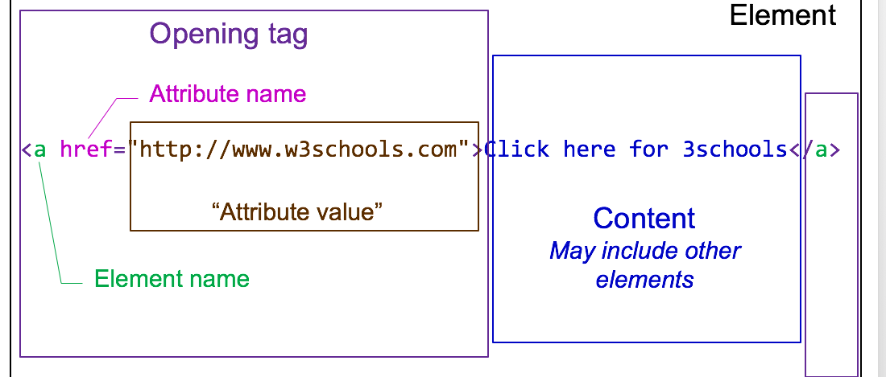
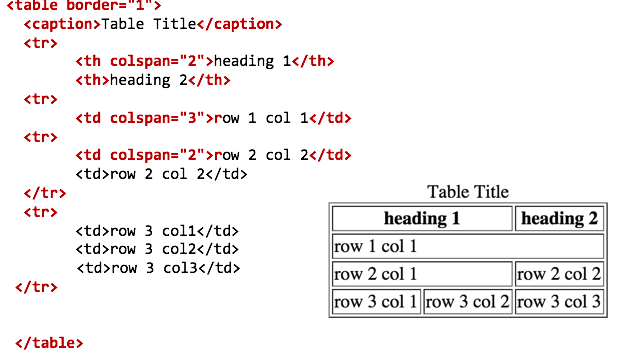

#Week 2 

[Week 1 Important Points](#week-1-important-points)
  [Element Syntax](element-syntax)
  [HTML Headings](#html-headings)
[How Do We Validate HTML](#how-do-we-validate-html)
[The HTML5 Template](#introducing_the_html5_template)
[Nested HTML Elements](#nested-html-elements)
  [HTML Lists](#html_lists)
  [HTML Tables](#html-tables)


#Week 1 Important Points

##Element syntax

**Remember elements are what we call HTML tags:**


- Basic building block of an HTML document
- container for content
- each type of element may contain certain other elements
- each type of element may have certain attributes
- some elements do not need closing tag (“void” elements) e.g. ``


##HTML Headings 

- Six levels of headings, elements h1 to h6

```html 
	<h1>This is biggest heading</h1>
	<h2>This is smaller heading</h2>
```


#How do we validate HTML?

-  [W3C offers a online validation service](https://validator.w3.org/)
-  It's very important you write valid HTML 


#Introducing the HTML5 Template

- It's often useful to create a starting HTML template. Here's what mine looks like (feel free to use it): 

```html
<!doctype html>
<html lang="en">
<head>
  <!-- ensures the document is using the correct char set --> 
  <meta charset="utf-8">
  <meta name="description" content="a quick description of the page goes here">  
  
  <title>Insert a meaningful title here</title>
  <link rel="stylesheet" href="css/styles.css?v=1.0">
</head>

<body>    
          
        
         <!-- These are block level elments, using them creates a new line 
              takes up the whole space available
         !-->
         
         
         <h1 style="background-color:black; margin:5px">I am a h1</h1>
         <p style="background-color:black; margin:5px"> I am a paragraph, I start a new line and take up full width available to me </p>

</body>
</html>

```
##Some New Tags

- You'll notice that my template has some tags that you're perhaps not familiar with:
 
- `<meta>` tags allow us to add further descriptive information about our page are always placed in the `<head>` section of the page. 
- `<link rel="stylesheet" href="css/styles.css?v=1.0">` this pulls in a style sheet. We'll look more into this next week


 


#Nested HTML Elements

##HTML Lists 

- Introducing the unordered list element
- Used for lists (obviously) and for navigation links

```html

<ul>
	<li>List item one</li>
	<li>List item two</li>
	<li>List item three</li>
</ul>


```
**Browser output**

<ul>
<li>List item one</li>
<li>List item two</li>
<li>List item three</li>
</ul>

   
##HTML Tables


- The `<table>` tag encompasses the whole table 
- It contains rows, each one is a `<tr>` element
- Each row may contain a mixture of heading and data cells which are defined by the `<th>` and `<td>` tags
- Optionally you may also add a `<caption>` to your table

###Table Attributes

- The `<table>`, `<td>` and `<th>` tag elements can also contain attributes to modify the look and feel of the table.
- `<table border= "1">` this can be used until we introduce CSS
- `<th colspan="2">`, `<td colspan="2">` defines the number of columns a cell should span


###Attributes Example




