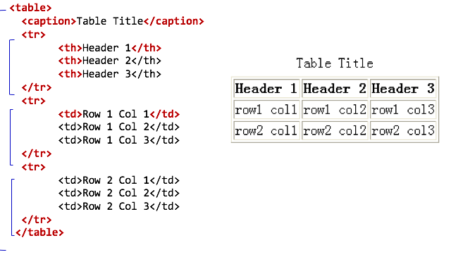

#Week 2  - Introduction to Tables 


##Element syntax



- Basic building block of an HTML document
- container for content
- each type of element may contain certain other elements
- each type of element may have certain attributes
- some elements don’t need closing tag (“void” elements) e.g. ``

##HTML Headings 

- Six levels of headings, elements h1 to h6

```html 
	<h1>This is biggest heading</h1>
	<h2>This is smaller heading</h2>

```

- Use the heading order sensibly and do not skip heading levels (e.g. from h2 to h6)

##How do we validate HTML?

-  [W3C offers a online validation service]
   (https://validator.w3.org/)
   
   
##HTML Table Elements 




- The `<table>` tag encompasses the whole table 
- It contains rows, each one is a `<tr>` element
- Each row may contain a mixture of heading and data cells which are defined by the `<th>` and `<td>` tags
- Optionally you may also add a `<caption>` to your table

###Table Attributes

- The `<table>`, `<td>` and `<th>` tag elements can also contain attributes to modify the look and feel of the table.
- `<table border= "1">` this can be used until we introduce CSS
- `<th colspan="2">`, `<td colspan="2">` defines the number of columns a cell should span


###Attributes Example






