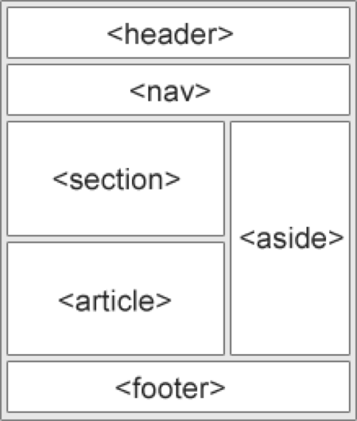

#Using the descendant selector 

- The descendant selector matches all elements that are descendants of given element
- We can use it to avoid the over use of id’s and class attributes

**css**

```html 
#contact_section p{

      font-color: grey;
      font-size: 10px		

}
```
**html**
  

```html
<div id=“contact_section”>

  <p> This will be grey </p>
  <p>   I’ll also be grey </p>

</div> <!-- /#contact_section -->

```

#Lists For Navigation Bar’s

- List are a great way to group common elements, therefor they are the go to when it comes to implementing menus in HTML. 

- We can use the HTML descendant selector to target child elements of our `<ul>`


**html**

```html
<div id="header">
            <ul>
                <li><a href="#"> Home </a></li>
                <li><a href="#"> Contact </a></li>
                <li><a href="#"> About </a></li>
            </ul>
</div> <!-- /#header -->

```

**css**

```
#header ul li {
    
    list-style: none; /** removes bullet points 8*/
    display: inline; /*flattens the list **/
    margin-left: 10px;  /** spaces out the menu **/
}
```

#CSS3 Gradient And Radius

- CSS3 is the latest version of CSS
- There are many new exciting features
- For example, it's now easy to apply effects to our html elements 
- Look how easy it is to create an interesting effect on the below `<div>`, by using the radius and gradient property. 



```css
.box1{
	width: 100px;    
	height: 100px;    
	border: 2px solid black;    
	border-radius: 10px;    
	background:   linear-gradient(red, blue);
}

```

#HTML5 Semantic Elements

- HTML5 gives us the option to use HTML elements that are more expressive. This is good news, as we  don't have to use `<div>`'s for everything
- We can replace now `<div>`’s with more meaningful tags
- E.G. Instead of using `<div id=“header”>` we can use the <header> tag

##HTML5 Semantic Elements Examples



 - `<header>`: defines a header for a document or a section
- `<nav>` - defines a container for navigation links
- `<section>` - defines a section in a document
- `<article>` - defines an independent self-contained article
- `<aside>` - defines content aside from the content (like a sidebar)
`<footer>` - defines a footer for a document or a section


##Example of a HTML 5 Layout  
```html
<body>
 <div id=“wrapper”>  
    <header>
          <h1>Header</h1>
    </header>
    <aside>
         <nav>
            <p> This is your left navigation … </p>
         </nav>
    </aside>
    <section>
          <h2>Subheading</h2>
          <p> This is the content part … </p>
    </section>
    <footer>
           <p> Footer </p>
    </footer>
</div> <!-- ./wrapper -->
</body>

```






