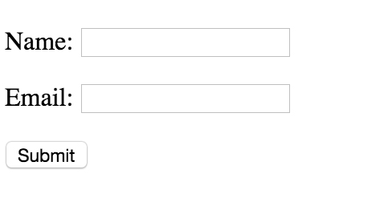

##Week 8 HTML Forms


##Introducing the form element 

```
<form>

......   /** form controls go here */

</form>

```
- A container for the controls (e.g. text field, checkbox, radio buttons etc.)

- There the are some new attributes we need to used in the form 

	- Consider the following form
	
	```
	<form action="http://www.google.com" method="post">
	
	</form>
	```
  -  **action** where the form is sent to 

  -  **method**  specifies how the form is to be sent 
		- **get** : data is appended to the URL
		- **post** : data is included in body of the form 
 
 
##Adding some form inputs


 - The `<input>` Element, handles most form controls
 
 - Just like with our `<form>` tag there are a few different attributes we need to know when it comes to `<input>`
 
**Consider An example Form**

  
```      
<form action="http://www.google.com" method="post">    
	<p> <label for="name">Name:</label> <input type="text" name="name"> </p>    
	<p> <label for="email">Email:</label> <input type="text" name="email"> </p>    
	<p><input type="submit" name="Submit" value="Submit"></p>
</form> 

```
     
 

- Let's break down the above example

	-  `<input>`'s change their look and feel based on the `type` attribute, on the above form we have two different  types, `text` and `submit`
	-  `<inputs>`'s have a `name` attribute, this is important as it's tied to the inputted user value
    
   - `<inputs>`'s can also have a `value` attribute assigned to them.  
	
	- `<label>`'s are specialists form elements used for marking form controls. Note how they have a `for` attribute tying them to a specific input  

 - **Well look more into laying out forms next week** but notice how the inputs and labels are wrapped in `<p>` tags. This is considered good practice


#Some different inputs 

Let's further look at some further form inputs. 


##Input - Radio Box  
  

  
  ```
  <label for="rating">  Please enter rating   </label>
  <p><input type="radio" name="rating" value="excellent"> Excellent</p>
  <input type="radio" name="rating" value="good"> Good </p>
  <input type="radio" name="rating" value="bad"> Bad </p>
  ```
     
  
- The buttons in the same group have the same name

- If the user selects excellent, the server will receive: `rating=excellent`

- Radio buttons let a user select **ONE*** choice 


##Input - Check Box

 

- Similar to check boxes, however they allow MULTIPLE choices


##Drop Down List
 
```<label>Shipping method: </label>   
	<select name="shipping">
					<option value="1"> Standard</option>
					<option value="2"> 2-day</option>
					<option value="3"> Overnight</option>
	</select>
```		


 - You can create a list using the `<select>…</select>` tag, giving the items in the list by using the <option> tag
 - If the user selects "Standard", the server side will receive: `shipping=1`
 

##Text Area 

```   
   <label  for="suggestion"> Enter a suggestion </label>
	<textarea name="suggestions" rows="5" cols="25"> my suggestions are:</textarea>
	
```

 - Used for multiple line inputs
 - The attributes `rows` and `cols` specify the size 	
	

#HTML5 Form Validation

- HTML5 allows us to instruct the browser to validate the form before it's sent to the server

- We can use the `required` operator in order to specify a required field 

	- `<input type="text" name="Name" required>`

We can use specific input types
	
- Some  common HTML5 input types are:

- color   
- date   
- datetime   
- datetime-local  
- month  
- search  
- tel  
- time  
- week 


